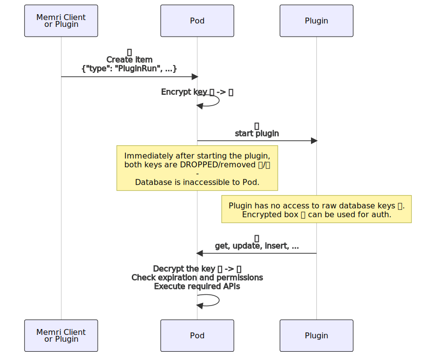

# About
This documentation is part of [Pod](../README.md).

Security is extremely important for the Pod as it is the central place
from which all user's data is accessed in Memri infrastructure.

We believe people have the right for privacy.

This page gives an overview of Pod's security model.

# Requirements
We believe data is yours and yours only.
We limit our own access to this data as much as technologically possible.

It's important to be very precise and transparent on this, 
so here are the exact requirements:

* All data should be [at-rest](https://en.wikipedia.org/wiki/Data_at_rest#Encryption) encrypted.  
    This means that only encrypted data is ever written to disk.
    This protects the user in case of unauthorized access or theft of the hardware,
    or in case of an accident (such as throwing old/damaged hard drive away).

* Adding to the previous requirement, by "data" we mean
    all kinds of data, including _metadata_. This prevents the well-known:
    * "They know you rang a phone sex service at 2:24 am and spoke
        for 18 minutes. But they don't know what you talked about."
    * "They know you called the suicide prevention hotline
        from the Golden Gate Bridge. But the topic of the call
        remains a secret."
    * "They know you spoke with an HIV testing service, then
        your doctor, then your health insurance company in the
        same hour. But they don't know what was discussed"

    (Quoting the famous EFF presentation).  
    This type of data remains encrypted and protected same as any
    other kind of information in Memri.

* No data is available to Pod outside of an HTTP request.  
    This requirement extends "at-rest" encryption by further shrinking
    the time window when Pod has encryption keys held in its memory.
    (This is also a general security best practice.)

* User should be able to define which Plugins are installed on their Pod.
  By default, there should be no Plugins installed at all,
  and the Pod should act purely as secure storage.
  Removing a Plugin should completely prevent any kind of data access by that Plugin.

* For each Plugin that the user has installed, there should be an explicit,
  declarative description of data that this Plugin can read or write.
  Plugins should be technically restricted from accessing any data
  they weren't explicitly permitted to touch.
  ⚠️ WARN: this restriction is not implemented yet, although the technical ground for it
  has recently being added to the codebase.
  See [tracking issue](https://gitlab.memri.io/memri/pod/-/issues/358).

# Solution - database
To encrypt data on disk, we use [sqlcipher](https://github.com/sqlcipher/sqlcipher).
As described in [HTTP_API](./HTTP_API.md), any request must supply an Auth json
that will contain (possibly in encrypted form) the required database key used for decryption.
Since sqlcipher is a whole-database encryption method, all of: data, metadata and search indexes
are fully encrypted.

# Solution - Plugins
Keeping the promise of full database encryption and Plugin restriction is in particular hard because
neither Pod nor any Plugin should have full access to the database/keys --
except in a web request made by the Plugin.

The solution for that problem is encryption+signing of the encryption key itself.
It works in the following way:

* Each time Pod is (re)started, a cipher is generated.
  We use XChaCha20Poly1305 at the moment 
  (see description of the algorithm [here](https://doc.libsodium.org/secret-key_cryptography/aead)).
* This cipher only exists in memory and is never written to disk.
* When a Plugin needs to be started, `database_key` and (optionally permissions in the future)
  are encrypted in a "secretbox" PluginAuth object. This object is passed to the Plugin.
* Plugin cannot look inside the "secretbox" or modify it (without breaking signature).
  It can only store this PluginAuth and use when accessing Pod API.
* When Pod receives a PluginAuth HTTP request, it verifies the signature and decrypts the
  database key. If there are additional permissions attached in the "secretbox" or described
  in the database, Pod can limit the API access for the Plugin 
  (TODO: note that this part is not implemented yet).
  Permission restrictions will include expiry date for the access,
  item type / properties specification,
  filters for one particular item or a time range for the items, etc.
* Since the combination of PluginAuth and the in-memory cipher would be enough 
  to re-calculate the database key, PluginAuth object is dropped
  before responding to the HTTP request.

This flow can be illustrated by the following diagram:

<!--
mermaid
sequenceDiagram
    participant MCoP as Memri Client   or Plugin
    MCoP->>Pod: 🔑  Create item  {"type": "StartPlugin", ...}
    Pod->>Pod: Encrypt key 🔑 -> 📦  
    Pod->>Plugin: 📦   start plugin
    Note over Pod: Immediately after starting the plugin, both keys are DROPPED/removed 🔑/📦   -   Database is inaccessible to Pod.
    Note over Plugin: Plugin has no access to raw database keys 🔑.   Encrypted box 📦 can be used for auth.
    Plugin->>Pod: 📦  get, update, insert, ...
    Pod->>Pod: Decrypt the key 📦 -> 🔑   Check expiration and permissions   Execute required APIs
-->

# Future
Note that this security architecture is not final, and it will change.

* We may introduce a little bit of caching, e.g. to cache the Schema file in memory for performance reasons, outside of an HTTP request. (We will never cache any sensitive user data though).
* We will harden the transport layer, right now we're relying on simple https. This will definitely change and improve a lot.
* We need to constantly improve all of the aspects around this software, beyond just code. In particular: hosting, build servers, release signing, etc etc.

# Questions?
Please reach out if you have any question / comments!

* [Discord](https://discord.com/invite/BcRfajJk4k)
* [Forum](https://discourse.memri.io)
