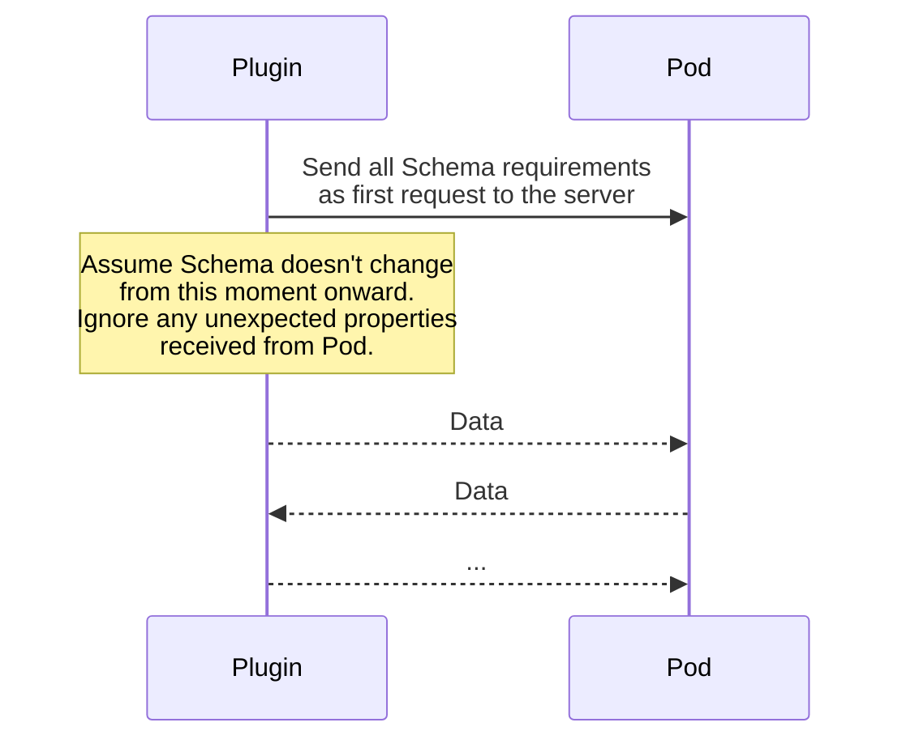
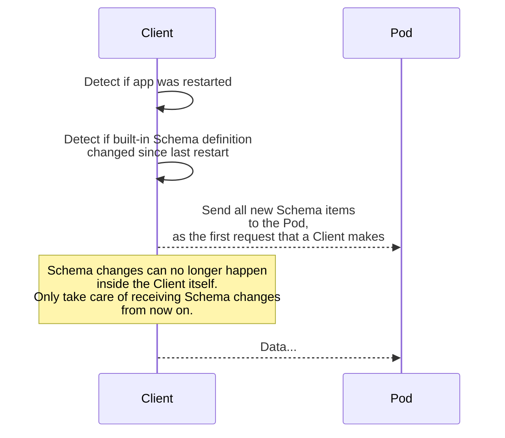
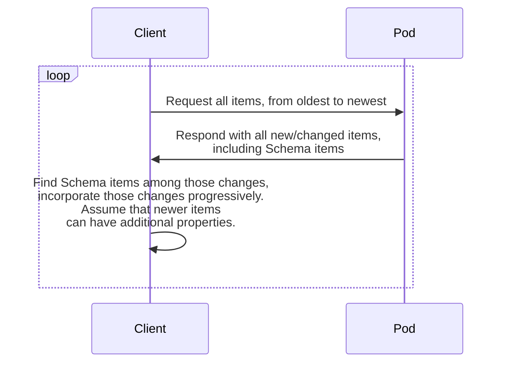

# About
This documentation is part of [Pod](../README.md).

Synchronization is the process of synchronizing items,
edges and Schema between Pod and various clients:

* plugins created by us and the community
* mobile clients
* desktop apps
* web clients

This page explains what are the requirements for synchronization, and how we're solving them.


# Requirements

## Plugin sync requirements
* It should be possible to specify the item types and properties
  that the plugin will write to Pod.  
  **Note:** in the future plugins will have to specify
  all items and properties they wish to read/write in a "plugin metadata" file.
  Plugins will be restricted from accessing items/properties that were not defined
  and approved by the owner. For now, plugins are able to access the full DB.
* It should be possible to write all the declared new properties of the items.

## Client sync requirements
By "client" we mean a Memri client (mobile app, desktop app, browser app etc).
The requirements are:

* The client should get information from the Pod
  assuming Schema might change at any moment.
* Schema changes in the Pod should be incorporated into the Client's Schema
* Schema changes in the Client should be incorporated into Pod,
  the client should be able to push a new Schema at any time
  (possibly as a separate request).
* In the future, clients will not have their own Schema, but instead,
  use a "client Schema" that is shared between all clients.
  This way we want to ensure that all clients are and stay compatible
  to each other.
  For now, clients technically have unrelated Schemas,
  and they all should assume that additional items/properties can be created
  by other clients/plugins.
* In the future, there will potentially be a more complex algorithm for CVU synchronization.
  For now we assume that CVU is inserted by clients just as data,
  and synchronization of CVU happens the same way as synchronization of data.


# Solutions

## Plugin sync

* At the start of each Plugin run, the Plugin should add the relevant Schema
  as the first request to the Pod that it does.
  After that, the Plugin should assume that the Schema changes are persisted on Pod.
  The Plugin should insert data normally.

* When reading data, Plugin should ignore unknown fields.
  In the future, Plugins will simply not see items/properties that they didn't declare as readable.
  The Plugin will also not be installable unless the user confirms access to said items/properties.

## Client sync
Client synchronization is covered by 4 main topics:
Schema synchronization from the Client to Pod,
Schema synchronization from Pod to the Client,
items/edges synchronization fom Pod to the Client,
items/edges synchronization from the Client to the Pod.

### Client-to-Pod Schema sync


Schema can change in the client internally in (at least) the following situations:

* When an app is first installed, it has a default bundled Schema with it
* When an app is upgraded, the bundled Schema might change as well
* In the future, Clients will possibly be able to install
  new Plugins and the Schema that comes with it themselves.

For these situations, Clients must be able to detect the Schema change
and send all the changes to the Pod.
It **should be the first request** sent to the Pod after such situation is detected.
The request itself is executed normally,
same as any other [request to update the Schema](./HTTP_API.md#schema-api).

### Pod-to-Client Schema sync


The other direction of Schema changes is from Pod to Client.
This can happen when:
* Pod is upgraded
* Plugins that add Schema items are installed
* Another Client installed new Schema/Plugins,
  and these changes need to propagate to all Clients of the same owner.

The Client doesn't need to do any special actions in this situation,
because Schema will be synchronized normally along with other items via items/edges sync (below).

If for some reason the Client wants to have a "quick" access to the latest Schema,
without doing the full synchronization process first, then it should
query all new Schema items from the Pod via a `/search`
```
{ "type": "ItemPropertySchema" }
```
request, but _ignore_ the dateServerModified property
and only keep the Schema changes themselves in memory.

### Pod-to-Client items/edges sync
The Clients fetch data from the Pod using requests like `/search`
```json5
{
    "dateServerModified>=": 1234567890, // maximum already fetched dateServerModified value
    "limit": 1000 // any limit that the client chooses, or none at all for unlimited size
}
```
In other words, Clients should progressively fetch items from oldest to newest.

In the future, the Client could have per-Item-type synchronization process.
For example, fetch Note items eagerly as they are relatively lightweight,
but ignore changes in FacebookFriendPost items
because you're on mobile internet (metered connection).
For now, this mode of operation is not supported,
and Clients only fetches the full DB incrementally.

Clients are free to choose their own sync intervals,
recommended duration is 3-60 seconds for now (3 seconds is a safe choice).

### Client-to-Pod items/edges sync
The client should keep track of all changed items and send them in batches using `/bulk` API.

Only the changed properties should be sent in "update" requests. For example, if you

* added property "a"
* deleted property "b"
* didn't touch properties "c", "d", "e", "f"

Then your request should include `"a": "newValue", "b": null` but should not include
the other properties "c", "d", "e", "f".

Clients decide the amount and distribution of data themselves:
* They are free to choose the size of batch in `/bulk` requests
* They are free to choose whether and how many items to send
  based on WiFi / mobile network presence, user preferences etc.
